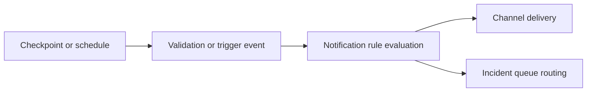

# Checkpoints and Notifications

## What this page covers

This guide describes how checkpoints, schedules, notification channels, rules, and
triggers fit together in the dashboard's operational model.

## Before you start

- A source and validation flow worth automating.
- Permission to manage schedules, notifications, and incidents.
- At least one notification channel configured or ready to create.

## UI path or entry point

Use the checkpoint or schedule workflow for execution timing and Notifications or
Notifications Advanced for channel, rule, and queue configuration.

## Step-by-step workflow

1. Define the validation flow you want to run on a schedule or trigger.
2. Configure the notification channels that should receive messages.
3. Create rules that map conditions to channels.
4. Configure queues and advanced routing if incident work should be separated from raw
   delivery notifications.
5. Test the configuration before relying on it in production.

## Expected outputs

- A repeatable execution path for validation or related checks.
- Delivery rules and logs that make notification behavior auditable.
- A clean separation between human work routing and outbound message delivery.

## Failure modes and troubleshooting

- If messages do not send, test the notification channel independently first.
- If incidents appear but messages do not, inspect rule configuration rather than queue
  state.
- If messages send too often, review deduplication, throttling, or escalation
  configuration in the advanced notifications surface.

## Related APIs

- `GET /schedules`
- `POST /schedules`
- `GET /notifications/channels`
- `GET /notifications/rules`
- `GET /triggers`

## Next steps

Continue with [Incident Workbench](incident-workbench.md) or
[Security and Secrets](../operations/security-and-secrets.md).
