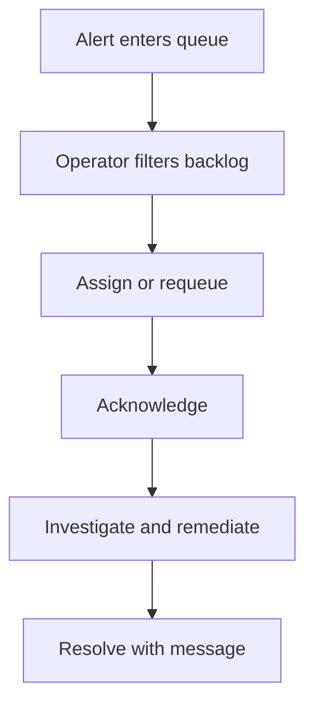

# Incident Workbench

## What this page covers

This guide is the operator runbook for the Alerts workbench: filtering, queue triage,
assignment, acknowledgement, resolution, correlation review, and saved-view reuse.

## Before you start

- Permission to read or write incidents.
- At least one queue configured in the current workspace.
- A practical triage model for who owns which incident class.

## UI path or entry point

Open **Alerts** for active triage and **Notifications Advanced** when you need to
change queue membership or routing defaults.

## Step-by-step workflow

1. Filter the alert list by severity, status, queue, assignee, or search term.
2. Apply a saved view if this is a recurring operational slice.
3. Open the incident detail and review the timeline, correlations, and affected source.
4. Assign or reassign the incident to a user or queue.
5. Acknowledge the incident when work starts.
6. Resolve the incident when remediation is complete and capture a useful message.

## Expected outputs

- Queue and assignee aware triage across the current workspace.
- A complete timeline for each operator action.
- Reusable saved views in the `alerts` scope.

## Failure modes and troubleshooting

- If the backlog is too noisy, use queue and assignee filters before changing incident
  severity thresholds.
- If work is duplicated, review acknowledgement habits and queue membership.
- If the same incidents recur after resolution, compare them with validation history and
  notification rules before changing queue structure.

## Related APIs

- `GET /alerts`
- `GET /alerts/{alert_id}`
- `POST /alerts/{alert_id}/assign`
- `POST /alerts/{alert_id}/acknowledge`
- `POST /alerts/{alert_id}/resolve`
- `GET /incident-queues`

## Next steps

Continue with [Reports and Data Docs](reports-and-datadocs.md) if incident handling
needs a shareable artifact, or [Notifications, Alerts, and Queues](../api-reference/notifications-alerts-queues.md)
for contract-level detail.
