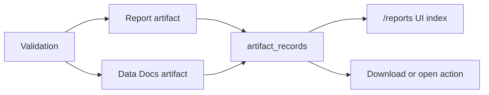

# Reports and Data Docs

## What this page covers

This guide explains the artifact lifecycle for operator-facing outputs, including
reports, Data Docs, download behavior, freshness, expiry, and the role of the `/reports`
browser route.

## Before you start

- A completed validation.
- Permission to read and write artifacts.
- A clear consumer for the output you are about to generate.

## UI path or entry point

Use the validation detail page to generate artifacts, then use the `/reports` route to
browse the artifact index. In API terms the canonical surface is `/artifacts`.

## Step-by-step workflow

1. Generate a report or Data Docs artifact from a validation.
2. Open the `/reports` route and filter by type, status, or search terms.
3. Review artifact metadata such as format, locale, generation time, freshness, and
   download counts.
4. Download or open the artifact through the artifact action.
5. Clean up expired artifacts or investigate stale artifact counts from the artifact
   overview slice.

## Expected outputs

- Type-consistent artifact records for both reports and Data Docs.
- A single browsing experience for generated outputs.
- Download or open semantics that match the artifact type and storage mode.

## Failure modes and troubleshooting

- If the route is available but data is empty, check workspace scope and artifact
  permissions first.
- If a Data Docs artifact opens to the wrong location, inspect the stored external URL
  or file path on the artifact record.
- If artifacts appear stale, compare overview freshness counts with the artifact list
  filter and retention settings.

## Related APIs

- `GET /artifacts/capabilities`
- `GET /artifacts`
- `GET /artifacts/{artifact_id}`
- `GET /artifacts/{artifact_id}/download`
- `POST /artifacts/validations/{validation_id}/report`
- `POST /artifacts/validations/{validation_id}/datadocs`

## Next steps

Continue with [Artifact Model](../concepts/artifact-model.md) or
[Artifacts](../api-reference/artifacts.md) for canonical contract detail.
