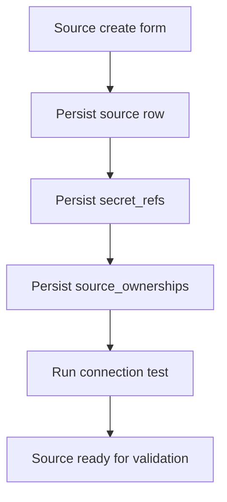

# Source Onboarding

## What this page covers

This guide explains the full onboarding workflow for a source, from selecting the
source type to saving ownership metadata and validating connectivity in the active
workspace.

## Before you start

- A valid session in the workspace where the source should live.
- Permission to read and write sources.
- Teams and domains created if you want ownership to be assigned during onboarding.

## UI path or entry point

Open **Sources** and use the create flow. The source list, source detail page, and
connection test action all participate in the same onboarding lifecycle.

## Step-by-step workflow

1. Choose a source type that matches the system you want to connect.
2. Fill out the common fields: name, description, environment, and non-secret config.
3. Enter secret-bearing connection values. These are persisted into `secret_refs` and
   replaced by redacted payloads on read.
4. Assign owner, team, and domain values if your workspace uses ownership-based slices.
5. Save the source.
6. Run a connection test and review the result before scheduling validations or profile
   generation.

## Expected outputs

- A source row scoped to the active workspace.
- Redacted secret fields on the detail screen.
- Ownership metadata visible in both list and detail views.
- A connection test result that clearly states success or the failing subsystem.

## Failure modes and troubleshooting

- If save fails, validate the source type payload and required fields first.
- If the connection test fails but the source saves, inspect credentials, host details,
  and network reachability rather than re-entering every field immediately.
- If ownership selectors are blank, create teams or domains first or leave the source
  intentionally unowned and track it from the overview.

## Related APIs

- `GET /sources`
- `POST /sources`
- `GET /sources/types`
- `POST /sources/{id}/test`
- `GET /teams`
- `GET /domains`

## Next steps

Continue with [Source Credentials](source-credentials.md) and
[Source Ownership](source-ownership.md) if you need a more operational explanation of
secret rotation or ownership slices.
