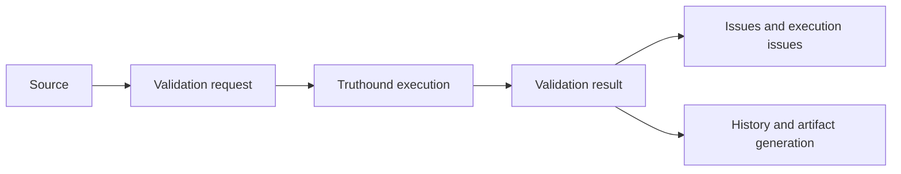

# Validation Run Model

## What this page covers

This guide explains how the dashboard represents a Truthound 3.0 validation run and
how operators should think about run inputs, run outputs, and execution controls.

## Before you start

- A source with a working connection test.
- Permission to execute validations.
- Familiarity with the difference between validator selection and result detail options.

## UI path or entry point

Start from a source detail page or from the source validations list. The run request is
submitted through the validations API and the result is displayed as a dashboard-native
view over the Truthound run object.

## Step-by-step workflow

1. Choose the source and start a validation.
2. Decide whether to use a simple validator list or a detailed validator config map.
3. Set any advanced execution controls such as schema path, auto schema, retry, or
   pushdown options.
4. Submit the run and wait for completion.
5. Review the returned fields and use them to decide whether to inspect issues,
   execution failures, or historical trends next.

## Expected outputs

- A validation identifier tied to the source.
- Canonical result fields such as run time, checks, issues, execution issues, row
  count, column count, and metadata.
- A status that can later be aggregated into trends and incidents.

## Failure modes and troubleshooting

- If the run cannot start, validate source connectivity and required permissions.
- If the run completes with execution issues, separate engine or input problems from
  business-rule failures before adjusting rules.
- If run detail is unexpectedly sparse, confirm the result detail options that were
  supplied in the request.

## Related APIs

- `POST /validations/sources/{source_id}/validate`
- `GET /validations/{validation_id}`
- `GET /validations/sources/{source_id}/validations`

## Next steps

Continue with [Validation Result Details](validation-result-details.md) and
[History and Trends](history-and-trends.md).
