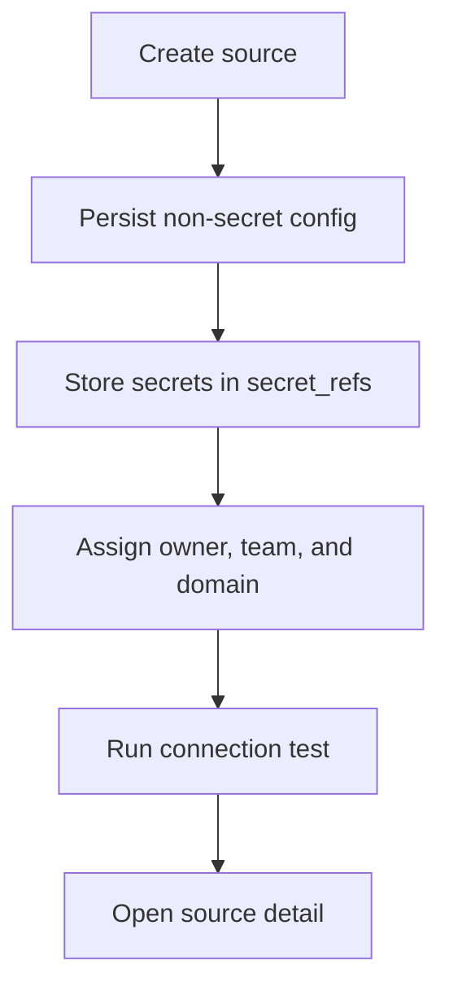

# Add Your First Source

## What this page covers

This page walks through the minimum onboarding path for a source, including source
type selection, secret-aware configuration, ownership assignment, and connection
testing.

## Before you start

- An active session in the correct workspace.
- Permission to create and test sources.
- The connection details for the dataset or file-backed source you want to onboard.

## UI path or entry point

Open **Sources**, then choose the create action. Ownership and credential fields are
part of the same source workflow, so you do not need a separate administration area
before your first connection test.

## Step-by-step workflow

1. Choose a source type that matches the system you want to validate.
2. Fill out the source name, description, environment, and non-secret configuration.
3. Enter secret-bearing values such as passwords, tokens, or keys only in the create
   form. They will be persisted through `secret_refs` and immediately redacted on read.
4. Assign an owner user, team, and domain if your workspace already uses ownership
   slices for triage and overview reporting.
5. Save the source and run a connection test. A successful test confirms the control
   plane can materialize secret references at runtime and build a usable data input.

## Expected outputs

- A source record visible in the Sources list.
- Redacted configuration on the source detail page.
- Ownership metadata attached to the source if you supplied it.
- A successful connection test or a concrete error message tied to the source type.

## Failure modes and troubleshooting

- If the source saves but the connection test fails, verify the raw credentials used
  during creation and confirm that the secret rotation path has not replaced them with
  stale references.
- If ownership selectors are empty, create teams or domains first or leave the source
  explicitly unowned.
- If the source is not visible after save, verify that your current workspace matches
  the one used during creation.

## Related APIs

- `GET /sources`
- `POST /sources`
- `POST /sources/{id}/test`
- `GET /teams`
- `GET /domains`

## Next steps

Continue to [Run Your First Validation](run-your-first-validation.md) to generate the
first validation result for this source.
