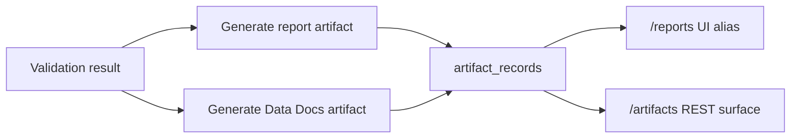

# Generate Your First Artifact and Data Docs

## What this page covers

This page shows how a completed validation becomes one or more artifact records,
including both downloadable reports and Data Docs outputs, and how the browser route
`/reports` maps to the canonical artifact model.

## Before you start

- A completed validation.
- Permission to generate and read artifacts.
- A preferred output format, theme, and locale for the first report.

## UI path or entry point

Open the validation detail page or the `/reports` route. In the product, `/reports` is
the artifact index screen. In the REST API, artifact generation and retrieval always
use `/artifacts`.

## Step-by-step workflow

1. Generate a report artifact from the validation detail page.
2. Choose the format, theme, and locale that match your audience.
3. Generate a Data Docs artifact for the same validation.
4. Open the artifact index and verify that both entries are visible, searchable, and
   typed correctly as `report` and `datadocs`.
5. Download or open each artifact through the artifact action menu. Reports usually
   resolve to a file download, while Data Docs may resolve to a stored file or an
   external URL.

## Expected outputs

- Two artifact records linked to the same validation.
- Type-aware actions in the artifact index.
- A stable download or open path through `/artifacts/{id}/download`.

## Failure modes and troubleshooting

- If generation succeeds but the artifact cannot be downloaded, confirm that the
  underlying file path or external URL still exists.
- If the report appears but Data Docs do not, inspect the Data Docs builder path and
  artifact creation logs.
- If the UI shows the artifact but the REST lookup fails, verify workspace scoping and
  current permissions.

## Related APIs

- `GET /artifacts/capabilities`
- `POST /artifacts/validations/{validation_id}/report`
- `POST /artifacts/validations/{validation_id}/datadocs`
- `GET /artifacts`
- `GET /artifacts/{artifact_id}/download`

## Next steps

Continue to [Triage Your First Incident](triage-your-first-incident.md) to learn how
operators route and resolve failures after validation output is available.
