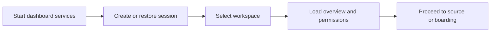

# Install and Run

## What this page covers

This page walks through the fastest supported path to start Truthound Dashboard,
connect it to a local Truthound 3.0 environment, and confirm that the control-plane
is healthy before you onboard any sources.

## Before you start

- A Python environment that can install the dashboard package and its dependencies.
- Access to the same workspace that contains your Truthound 3.0 project or sample
  data assets.
- Permission to create a local dashboard session and the bootstrap password for the
  initial workspace.
- If you are validating a hosted review environment instead of a local install, use
  the shared Render preview at `https://truthound-dashboard.onrender.com/`.

## UI path or entry point

Use the CLI to start the API and frontend, then open the dashboard root page in your
browser. The first interactive path is the session bootstrap flow that selects the
active workspace.

## Step-by-step workflow

1. Install the dashboard dependencies and start the application stack for your
   current environment.
   If you are using the shared hosted preview, open the Render URL directly and skip
   the local startup step.
2. Open the dashboard in a browser and wait for the `/auth/session` bootstrap call
   to complete.
3. Sign in with the local bootstrap password or an existing session token.
4. Confirm that the default workspace loads and that the Overview screen shows the
   expected source, incident, and artifact summary cards.
5. Open the health or observability surfaces only if you need to validate startup
   components such as the API process, scheduler, artifact storage path, or queue
   services.

## Expected outputs

- A valid session token returned by `/auth/session`.
- The active workspace, user, and role rendered in the shell header.
- Overview cards populated from the current deployment instead of placeholder data.
- No legacy or placeholder execution banners anywhere in the UI.

## Failure modes and troubleshooting

- If session bootstrap fails, confirm the password and workspace identifier.
- If the shell loads but summary cards are empty, verify that you are in the expected
  workspace and that the API can reach the dashboard state database.
- If startup succeeds but permission-gated pages return authorization errors, inspect
  the active role and normalized permission assignments rather than old role JSON.

## Related APIs

- `GET /auth/session`
- `POST /auth/session`
- `GET /me`
- `GET /overview`

## Next steps

Continue to [Start a Session and Choose a Workspace](start-a-session.md), then onboard
your first source and run a validation flow end to end.
